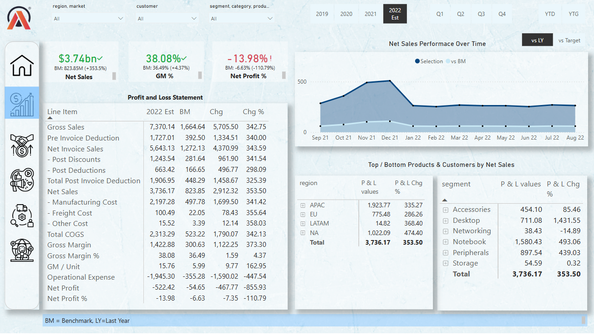
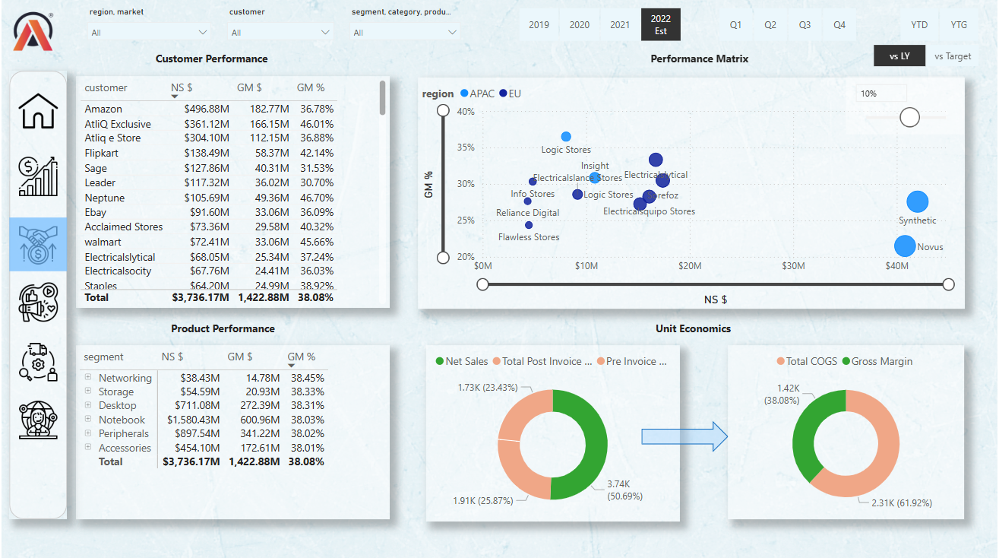
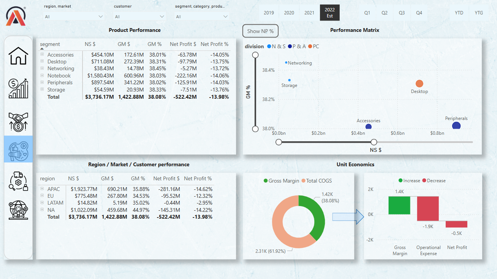
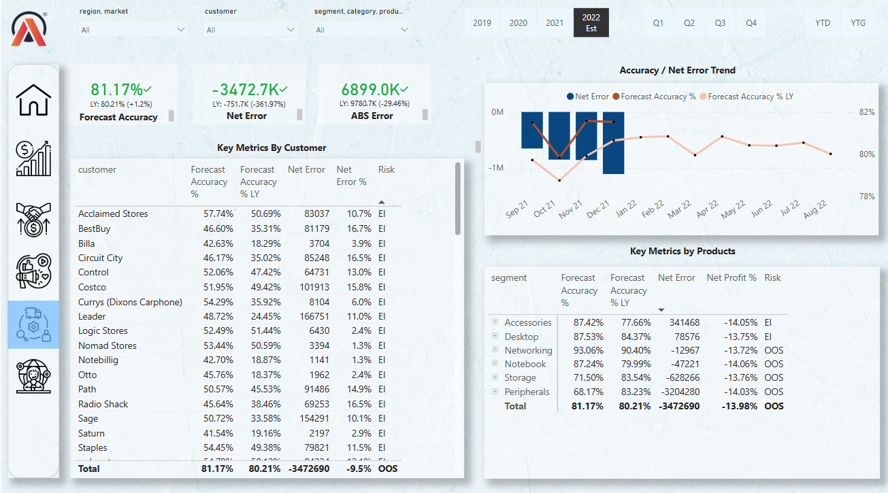

# 📊 Business 360 Dashboard – Atliq Hardware

A comprehensive and interactive Power BI dashboard designed to provide **end-to-end visibility** across core business functions:  
**Sales, Finance, Marketing, Supply Chain, and Executive Management** — all in one place.

---

## 🌟 Key Features

- 📁 Analyzed **1M+ records** from MySQL and Excel sources.
- 📊 Unified views for **Sales**, **Finance**, **Marketing**, **Supply Chain**, and **Executive**.
- ⚡️ Performance boosted by **30%** using DAX Studio.
- 💡 Delivered insights that supported a **projected 10% revenue increase**.
- 🧠 Advanced **DAX measures** and dynamic visualizations for deep exploration.

---

## 🧰 Tools & Technologies Used

| Tool          | Purpose                         |
|---------------|---------------------------------|
| 🟨 Power BI    | Data visualization & dashboards |
| 🐬 MySQL       | Querying and data extraction    |
| 📊 Excel       | Preprocessing and formatting    |
| 🧮 DAX Studio  | Optimizing calculations         |

---

## 🔗 Live Report

👉 **[View the Live Dashboard]( https://app.powerbi.com/view?r=eyJrIjoiMjU2ZDBhOTktZjE1My00ZDc5LTkwYTctYmJkMmRmNjM4MjE5IiwidCI6ImM2ZTU0OWIzLTVmNDUtNDAzMi1hYWU5LWQ0MjQ0ZGM1YjJjNCJ9)**  
> _Please note: Sign-in may be required to access the Power BI report._

---

## 🖼️ Dashboard Preview

